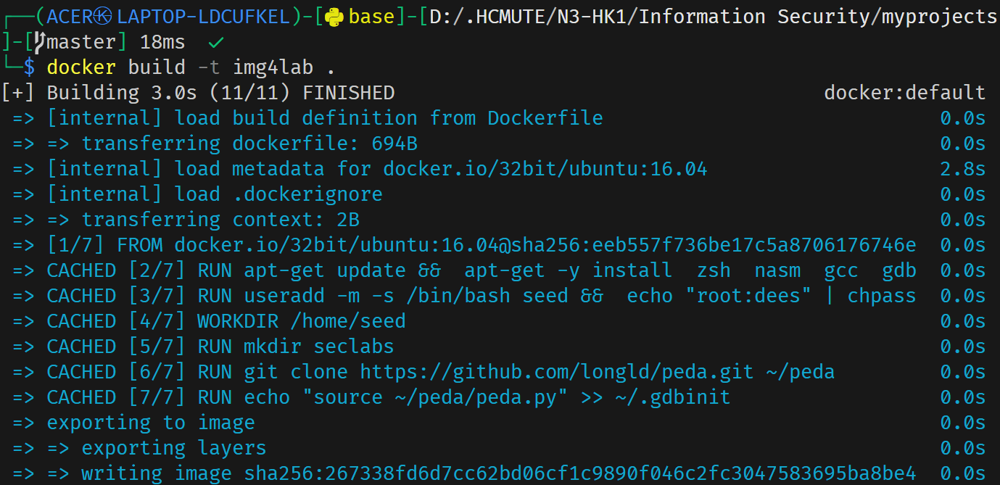

# Prepare for the attack

## Build the docker image

    docker build -t img4lab .

Wait a few minutes for the image to build

## Run the docker image

    docker run -it --privileged -v $HOME/Seclabs:/home/seed/seclabs img4lab

Here, I want to use another folder to map into the `/home/seed/seclabs` folder

